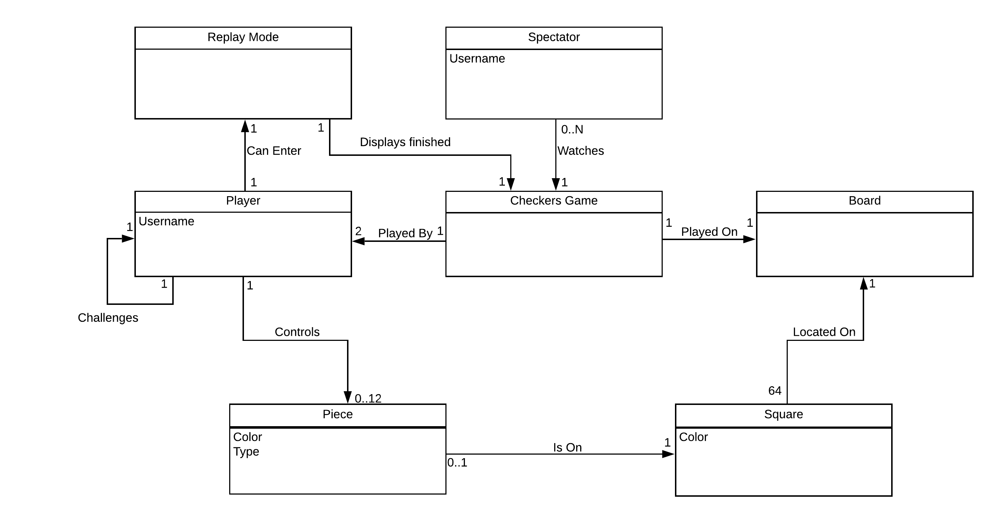
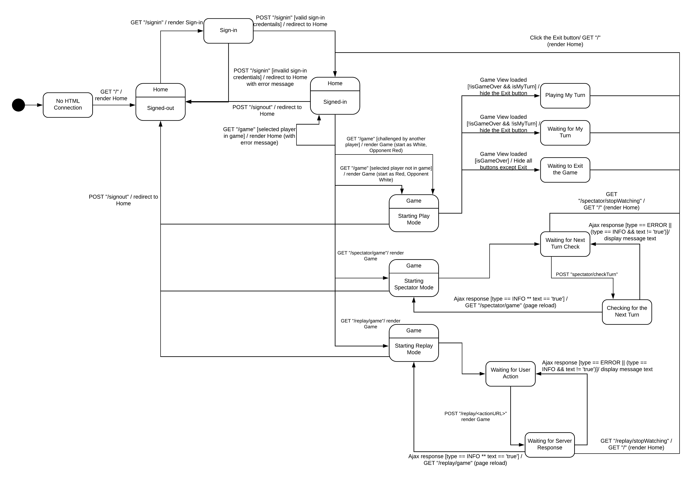
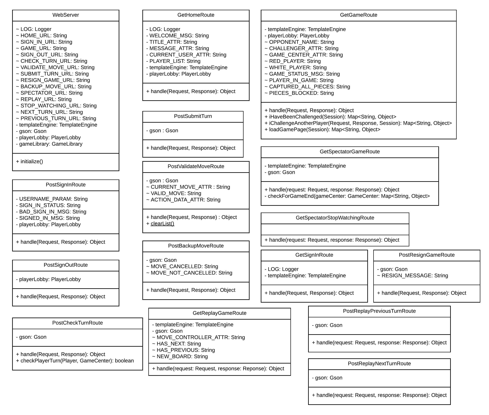
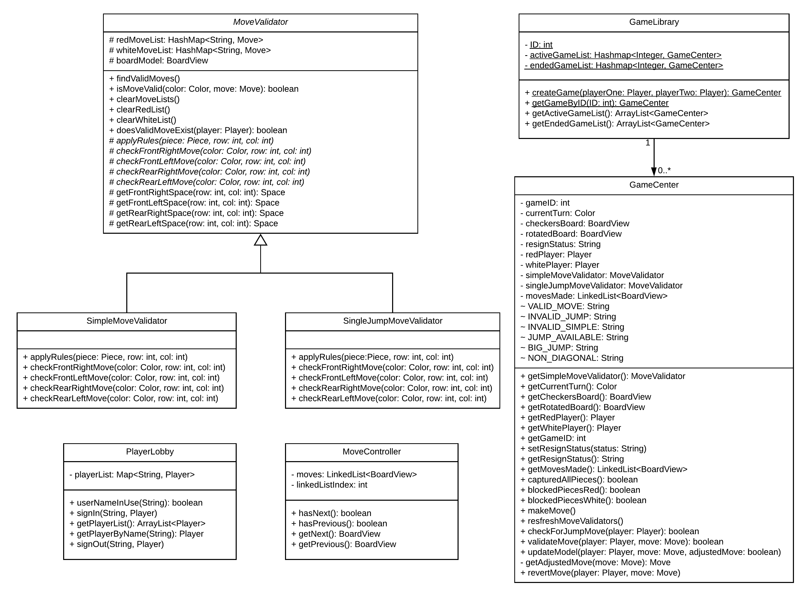
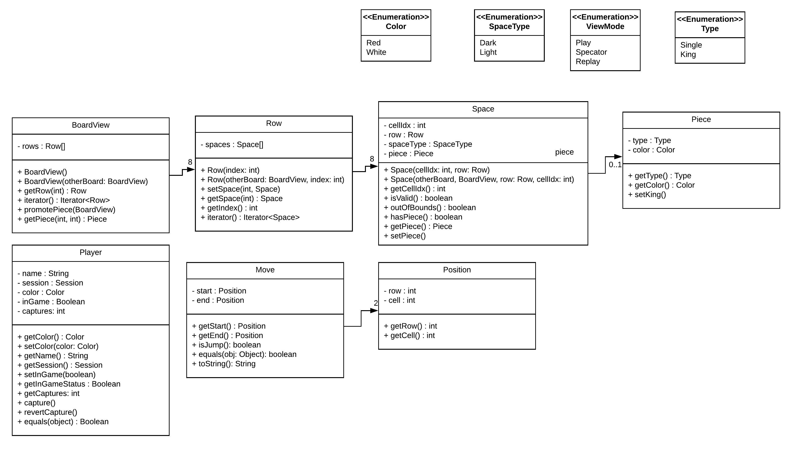

# PROJECT Design Documentation

## Team Information
* Team name: TeamC
* Team members
  * Faizan Ahmed
  * Neha Ghanta
  * Thomas Daley
  * Andrew Frank

## Executive Summary
The application must allow players to play checkers with other players who are currently signed-in. The game user
interface (UI) will support a game experience using drag-and-drop browser capabilities for making moves.

### Purpose
WebCheckers game for people to play Checkers against each other in a browser.

### Glossary and Acronyms

| Term | Definition |
|------|------------|
| VO | Value Object |
| UI | User Interface|

## Requirements

This section describes the features of the application.

### Definition of MVP
Players must be able to sign-in to play a game of checkers, and be able to sign-out when finished.
Two players must be able to play a game of checkers based upon the American rules.
At any point in a game, either player may choose to resign, ending the game.

### MVP Features
* Player Sign-in
* Player Sign-out
* Resignation
* Start a Game
* Simple Move
* Single-Jump Move
* Multi-Jump Move

### Roadmap of Enhancements
* Spectator Mode
  * Game Viewing
  * Viewer Count
* Replay Mode
  * Archiving
  * Replay Game

## Application Domain

This section describes the application domain.

The game contains a Checkers board, that board contains Squares, which Pieces are placed on.
A Player plays a WebCheckers game on that board, using those Pieces. A Player can enter a tournament to play WebCheckers
against other Players, and a Spectator is able to watch an ongoing game between two other Players.

## Architecture and Design

This section describes the application architecture.

### Summary

The following Tiers/Layers model shows a high-level view of the webapp's architecture.

As a web application, the user interacts with the system using a
browser.  The client-side of the UI is composed of HTML pages with
some minimal CSS for styling the page.  There is also some JavaScript
that has been provided to the team by the architect.

The server-side tiers include the UI Tier that is composed of UI Controllers and Views.
Controllers are built using the Spark framework and View are built using the FreeMarker framework.  The Application and Model tiers are built using plain-old Java objects (POJOs).

Details of the components within these tiers are supplied below.

### Overview of User Interface

This section describes the web interface flow; this is how the user views and interacts
with the WebCheckers application.

Once an HTML connection has been established, a user will start off on the Home page, and have the option to sign-in. 
If their sign-in is not successful, they will be taken back to the Home page and given another opportunity to sign-in. 
If their sign-in _is_ successful, they are taken back to the Home page, and shown the list of all active players. 
If the User clicks on a name of an active Player, and that Player is not already in a game, the User is taken to the 
Game Screen, with their Pieces being red in color, and their opponent's white. If the Player is already in a game, 
the User is returned to the Home page and notified that that Player is already in a game.

### UI Tier

The UI tier is designed to handle incoming HTTP requests, and respond with HTML responses or JSON objects, as necessary.

When a user visits the website, the GetHomeRoute is used to build an HTML page, and sends that to the client, and they
are given the option to sign-in. If they choose to do that, the GetSignInRoute is used to render an HTML page allowing
the user to sign-in to the website. When they submit their username, the PostSignInRoute accepts the form submission,
and signs the user in as a Player. When a player is signed in, the GetHomeRoute is used again to render another HTML
page, this time with different information, including a list of all other players who are signed-in, a list of active
game, and a list of replayable stored games. 

For a Player to start a game, they would click another Player's name in the list, and the GetGameRoute is used to start 
a game between the two Players. The GetGameRoute will build an HTML page for each Player, and customise it to display
the correct information to each Player. When the game starts, the PostCheckTurnRoute is used to determine whose turn it
is. This controller is also used each time a Player submits a turn. When the Players are in-game, at any time, they 
have the option to resign from the game, and the PostResignGameRoute is used to handle this operation.  

To play the game, a Player will move their pieces on the board that they see, and when a piece is moved, the client
calls for validation of that move. The PostValidateMoveRoute handles this request, and responds with the status of the
move as a JSON object. If the player is unhappy with the move they made, they have the option to 'backup' that move,
and the PostBackupMoveRoute is used to handle this request. It too will respond to the client with a JSON object 
containing information about the status of the backup. If the player is satisfied with the move they've made, they have
the option to submit the turn, in which case the PostSubmitTurn controller will handle this request, and again respond
to the client with a JSON object. 

After a user has finished a game, they can see the game listed under "Stored Games" on the home page. If the user
clicks on the game they will be sent to the board before the first move by the GetReplayGameRoute. When the user hits 
"Next" the players move is reflected on the board using the PostReplayNextTurnRoute. When the user hits "Previous" the 
players move is reverted using the PostReplayPreviousTurnRoute. The user can leave the replay at anytime using the 
"Exit" button, and the user is returned to the homepage with the GetHomeRoute. 

At any time, a Player has the option to sign-out, and the PostSignOutRoute is used to handle this request.
The WebServer class instantiates all of these controllers, and some objects are instantiated because the controllers 
depend on them. 

### Application Tier

The application tier is designed to provide information to the UI-tier, based on the state of the model. It is also
responsible for applying any changes to the model that the UI-tier receives. 

The PlayerLobby provides information about how many Players are signed-in, and whether or not a username is already
being used by another Player when trying to sign-in. 

The GameCenter provides information about the current state of the board, the current state of the game, as well as what
color pieces each Player is using. This includes whose turn it is, if the game is over, and if a move is valid.

The MoveValidators are used by the GameCenter to determine any and all moves of their respective type that are available
according to the current state of the board.

The GameLibrary is used to create new GameCenters when a new game is starting. It is also used to store these games,
and keeps active games and games that have ended in two different lists to display the different game types in separate
columns on the Home page.

The MoveController is used only for the Replay Feature, and this class will retrieve each board state depending on
whether the user presses the 'Next' or the 'Previous' button on the client.

### Model Tier

The model tier is designed to hold the state of the board, spaces, pieces, and the players of the game.

The BoardView class creates an array of 8 Rows. Each Row in turn creates an array of 8 spaces. 
The space class then using the row and the index of the which space it is, determines if it is a valid space which is a 
dark colored space, or an invalid space which is a white colored space. The space class also determines if there should 
be a piece initially there when the board view is created. The piece class then stores the type of piece it is, which is
either a single or a king piece, and the color of that piece, which is red or white.

The BoardView, Row, and Space classes all have 'copy constructors' that are used to save the state of the board every
time a move is made. This is mainly used for the Replay Feature of this project.

The Player class stores important data that is used throughout the project. The data the class stores is the name, 
session, color, the player’s inGame status, and the number of captures that Player has performed. The name data is used 
for various things, like checking if the userName has been taken on not, and is used in the PlayerLobby class. 
The session data is used to help get the player’s current session and is used in the GetGameRoute class. Color is also 
used in the GetGameRoute while building the game viewModel as help determines if the player is Red or White. 
The inGame status which is a boolean helps to determine if the selected player is in a game or not which then gives a 
message if the status is true.

The Move class takes two positions: A start and end position. This data is used when the player makes a simple move or 
a jump.

The position class holds the row index and the space index.

## Significant Feature Flow

### Starting A Game

This sequence diagram shows the interaction between the shown entities when a Player challenges another Player to
a game of WebCheckers.

### Spectator Mode

This sequence diagram shows the interaction between the shown entities when a Player decides to watch two other players
play checkers using the Spectator Mode on the application.

### Design Improvements

An area of code that could be improved is the Replay Mode story. When implementing the replay mode we wanted to make a 
double linked list of the moves and show the game based on the next or previous move in the list. However, Java uses
a pointer to the BoardView object, so when a move was reflected it wouldn't update the game properly because it used the
same pointer to the original object. To finish the enhancement we decided to create a new copy of the board after each 
move and store it to a list. The list was used to display the "changes" on the board.  

If development were to continue, the next enhancement we would make would be to incorporate AI for a Player to play
a game of Checkers against the "Computer".

##Code Metrics Analysis:

At first glance, we did end up hitting our Code Coverage goals for each tier.

In the model tier, we have two classes that did not meet our Code Coverage goal. One was the Player class, and the 
reason for not meeting this goal was due to a last second bug fix, and not having unit tests for that bug fix. This fix
included a method in the Player class to reset the number of captures a Player has. The other being the Row class,
due to the fact that we did not cover the iterator method in that class. This method is relatively hard to test,
but is necessary for the operation of the application. 

In the application tier, we only have one class that did not meet our Code Coverage goal. This was the 
SimpleMoveValidator class, and the reason this did not meet our goal was due to a lack of testing every path
through the methods in this class. 

In the UI tier, we do have two classes that did not meet our Code Coverage goal. These included the WebServer class,
as well as the PostCheckTurnRoute class. The WebServer class was provided to us at the start of this project, and due
to that, we had overlooked writing unit tests for this class. The reason for missing the goal on the PostCheckTurnRoute
was again due to a lack of testing each path through the methods in that class.

## Testing
-
Methods:
* Acceptance Testing
* Cross-Team Acceptance testing

Results: See Acceptance Testing section below

### Acceptance Testing
-
Number of user stories that have passed: 12

Number of user stories that have not been tested: 0

Issues found during acceptance testing:
* Players could sign-in with non-alphanumeric characters
* In the case where a Player won by capturing all pieces, the game-end message would say that all of the pieces 
belonging to the Player who lost were blocked.
* Move backup after performing a multi-jump move would only work for the last jump made, and would throw an error
for any attempts at backing up moves that came prior to the last.

Issues found during cross-team acceptance testing:
* If a Player signed-in using a space in their username, when another Player tried to challenge them to a game, the 
Player challenging them would receive an unrecoverable error.
* When a Player resigned from a game, and another game was started between those Players, the game would automatically
transition to the 'Game Over' state, and say that the same Player had resigned, even though they hadn't resigned from 
this game.

### Unit Testing and Code Coverage
-
Unit Testing Strategy:

For the UI tier, unit tests should simulate expected actions, and test that the flow is correct based on those actions.
For the Model and Application tiers, simulate controller-level calls to modify parts of the model, and verify those
changes.

Code Coverage goal by tier:
* Model: 95%
* Application: 80%
* UI: 80%